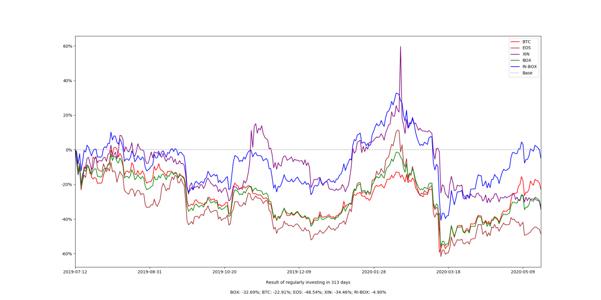

💝WHAT（本节在讲什么？）
"在错误的道路上，奔跑也没有用。" - 股神华伦巴菲特（Warren Buffett）这句名言似乎就在說：定投策略本身是正确的，难就难在标的的选择。

那，怎么选呢？一个最简单粗暴有效的原则：符合行业发展的趋势，就是本节要呈现的重要概念。

在整个章节探索过程，我们能加以本节小标题“在趋势之中符合趋势”的微言大义，在不同段落中反覆诘问，就更容易能对笑来老师选择过程中的权衡感知有所共鸣和有迹可循。

💝HOW（如何讲的？）
📮清楚任务：
了解笑来老师如何进行标的选择的过程。

📮清楚步骤：
❶步骤1 ，知道投资人本职就是争取投资收益
带着“p = δ + α - γ”公式反覆比照本节层层递进的说明，知道笑来老师在选择投资标的，就是在进行投资表现(P, Performance）极大化的争取。

P＝Performance，投资的最终成绩。
δ＝Delta，市场整体的成绩。
α＝Alpha，在投资领域，人们用第一个希腊字母 α 指称因为跑赢市场而获得的收益。
γ＝Gamma，因为人性不靠谱而没有赚到的那些原本应有的收益。
其中，β＝投资人的成绩与市场整体成绩的相关性。

这些希腊字母该怎么用呢？我们先从定投策略采用者最重要的任务：创造α说起。

❷步骤2：回顾笑来老师怎么创造 α ？（在投资领域，人们用第一个希腊字母 α 指称因为跑赢市场而获得的收益。）

笑来老师是这样做的：
• 一个还是全部（全球）
• 最佳的局部（区域）
• 最佳局部之中的最佳局部（行业）
• 最佳局部之中的最佳局部之中再选择若干个标的构成组合......

从上述四个选择的推进，见到笑来老师基于符合行业发展的趋势，在极力争取创造更多 α的过程：
(1)当选择全部时，表示和市场同步。此时虽然有跟上全部(地球/上帝)趋势进行避险，却无存在跑赢市场的收益空间。（α为零）

(2)当选择最佳的局部时，意思是虽然没有全部选，但选的是发展好的局部，就有可能创造正的α（α>零）。

(3)继续逼近，选择最佳的最佳的局部时，就有可能再创造更多正的α（α>>零）。

(4)物极必反，因此进行若干个标的构成组合，以平衡或冲淡风险发生的可能。

❸步骤3：举例（BOX）
笑来老师接着以BOX 为例，呈现他就是顺应区块链技术趋势，做出一位符合行业发展的趋势的定投策略采用者在进行α的创造。BOX就是在全部和局部之间层层递进选择的推进中，进而产生的投资组合。

BOX投资组合的三个标的：BTC、EOS、XIN，已经呈现"皆难否"的事实，足够代表定投策略采用者的选择已经正在顺应趋势，能明显看到区块链技术在改变世界的过程中有一个已经慢慢展现出来的发展路线。

其技术发展沿革就是在趋势中符合趋势，笑来老师就是在做符合行业发展的趋势当中的投资标的选择，已经是把β＝1（投资人的成绩与市场整体成绩100%相关）考虑进去了。

❹步骤4：举例（ODYSSEY）
ODYSSEY的设计也是符合行业发展的趋势的一项事例。毕竟，像是土壤就是喂养大树之根本，"绝大多数算法公司到最后都会为拥有数据的大公司所用"俨然已经是个必然的趋势。

备注：ODYSSEY就是数据应用龙头的投资组合，对技术细节感兴趣者可自行挖掘了解。

❺步骤5：反思
对于 α（跑赢市场的那部分盈利）究竟是否存在一直争议不小的问题进行反思。

定投策略使用者就是把所有复杂困难的事情在开始行动之前就仔仔细细选择，接着就是透过定投策略的长期不变，漠视往后市场变动、或是不用加入争论市场有没有效的问题了。

❻ 整体性了解笑来老师的选择

當我们基于"符合行业发展的趋势"原则进行投资时，就是让β＝1，让投资人的成绩和市场整体成绩100%相符合，让“p = δ + α - γ”更单纯许多。

由于选择无法避免主观知觉，笑来老师就以当β＝1（投资人的成绩与市场整体成绩的相关性100%），也就是投资人是基于"符合行业发展的趋势"的原则进行投资时，能使“p = δ + α - γ”更为单纯，进而就可以致力于α（跑赢市场而获得的收益）的提升。

💝WHY（讲得对吗？）
对照格式化创作，在Why逻辑思考的锻炼上，我们一样能在这三个模版上进行练习：
①提出一个现象，给出一个解释
例如，笑来老师经过过去8年多的观察、思考与实践，发现区块链技术在改变世界的过程，就是几乎所有技术从诞生到被广泛接受的，必然经历、从未变过的步骤。

②提出一个问题，给出一个解决方案
例如，笑来老师为了思考α（跑赢市场的那部分盈利）究竟是否存在一直争议不小的问题，他就明指定投策略采用者只在一开始的标的选择下最重要的功夫，接下来就是透过定投策略的长期不变，漠视往后市场变动、或是不用加入争论市场有没有效的问题了。

③分析下之后得到结论
“p = δ + α - γ”—-这个公式承接前面章节，并在此处深入贯穿全文。我们能透过这个投资公式，帮助自己理解笑来老师在投资标的选择过程之间的权衡和主观知觉，进而协助自己在投资标的选择思考上有所启发。

我得到非常重要的结论是，BOX不管成分如何变动，笑来老师身为一个自己身家都押进去的投资人，他利益关联都紧紧与BOX绑定的事证，就是一位积极在争取创造更多正的α的定投策略践行者。

【启示】
有这样的探索之旅，我对笑来老师2021年1月份将BOX进行成分调整的作为并不会感到慌张，因为笑来老师一定是在做创造更多正的α（跑赢市场的那部分盈利)的调整而已。

经过这趟了解“在趋势之中符合趋势”微言大义的探索之旅，即使自己不是技术专业，只要我谨守投资原则：用蛋壳投资、长期至少两周期、BOX成分怎么调整也不用大惊小怪了。

备注：BTC、EOS、XIN各自代表行业专业的技术细节。而BOX在2021年1月份，也因应行业发展趋势，已经将成分调整为BOX＝BTC、ETH、EOS、DOT、MOB、XIN、UNI。对技术细节感兴趣者可自行挖掘了解。

**1【划词性】圈出打卡章节所有的名词和形容词；文中有用的抽象名词有哪些?**
### 2.5 在趋势之中符合趋势

选择最重要，在投资领域当中尤为如此。回顾一下之前的内容，我们已然经历了很多次选择：

> - 一个还是全部（全球）
> - 最佳的局部（区域）
> - 最佳局部之中的最佳局部（行业）
> - 最佳局部之中的最佳局部之中再选择若干个标的构成组合......

然而，概括起来却很简单，这些全都是关于**趋势**的选择。不选择 "只投资某一个标的"，而是退而求其次 "选择所有" ------ 这是为了在避险的同时**跟上****整个世界的趋势**，此时 α 为零；从全部之中 "选择最佳的局部"，这是以退为进，意图找到发展最快的局部，进而有可能创造正的 α；再一次 "选择局部的局部"，这也是为了通过趋势的支撑获得更高的 α ------ 最终，在局部的局部之中做个组合，本质上依然是一样的做法：首先要降低风险，而后再看能否创造更多的 α？

为自己的投资组合选择标的，最简单直接粗暴有效的原则是：

> **符合行业发展的趋势**

以下将以 BOX 为例，因为它就是经过这样的选择过程而产生的投资组合。

> **风险警告**
> 定投策略本身是客观正确的，而定投标的的选择无论如何都没有办法剔除主观判断 ------ 所以，定投标的选择是投资者自己的事情，是要用自己今后长期的钱和时间去负责的事情。请务必慎重。
> 这一节的内容重点在于李笑来为什么要选择 BTC、EOS、XIN，即，BOX，作为一个定投的组合 ------ 这里必然掺杂着李笑来的一些主观判断；至于你选择怎样的投资组合，要靠你自己对客观世界的客观理解。
> **作者利益关联公示**
> - 李笑来是比特币的长期持有者（自 2011 年 5 月）
> - 李笑来是 EOS 发行公司 BlockOne 的天使投资人（2017 年 5 月）
> - 李笑来是 Mixin Network 项目的天使投资人（2017 年 10 月）

经过过去 8 年多的观察、思考与实践，我认为区块链技术在改变世界的过程中有一个已经慢慢展现出来的发展路线：

> 可信账簿（BTC）→ 可信代码平台（ETH/EOS）→ 可信执行环境（Mixin）→ 可信硬件（？）......

[比特币](https://bitcoin.org)是世界上第一个区块链技术的应用，它的核心是一个公开透明的、不可篡改、分布式可信账簿。而后来发展起来的[以太坊](https://www.ethereum.org/)和 [EOS](https://www.eos.io/) 的目标都是成为一个区块链应用平台，也就是说，程序代码要被写入并运行在公开透明的、不可篡改的分布式区块链平台上。把账簿放在区块链上，就有了可信账簿；把程序代码放在区块链上，就有了可信代码。[Mixin Network](https://mixin.one) 通过结合 TEE（可信执行环境）和 DAG（有向无环图）创建了新型的公开透明、不可篡改的分布式数字资产储值网络，也就有了可信执行环境。也许在不久的将来，我们还会看到可信硬件？

之所以没有选择以太坊是出于技术原因，它目前所采用的共识机制是 [PoW](https://en.wikipedia.org/wiki/Proof_of_work) ------ 这种以分钟为单位确认一次的共识机制，根本不可能成为可用的应用程序平台。事实上，以太坊过去三年左右的实际运行历史早已证明了这个缺陷在 PoW 机制下根本无法被解决。尽管以太坊计划未来会转移到 [dPoS](https://en.wikipedia.org/wiki/Proof_of_stake) 共识机制上，但那就意味着必然产生再一次分叉 ------ 2017 年以太坊已经因为之前考虑不周而被迫分叉出一个今天不知道可以用来干什么的 ETC ------ 也就是说，以太坊投资者所要面对的风险不可想象。

最终如此选择的理由还有一个，这是几乎所有技术从诞生到被广泛接受的过程中必然经历的从未变过的步骤：

> 诞生 → 先被企业采用（2B）→ 再被个体采用（2C）

EOS 从这个角度望过去，就是个面向区块链企业的平台。而 Mixin Network 的第一个 dApp，Mixin Messenger，就是个面向个体的平台 ------ 除了即时聊天之外，它的重要组成部分之一就是目前行业里对新用户最为友好最为方便的分布式多币种钱包（这是底层 Mixin Network 公链的功能）。

另外，在我看来，这三个标的都到了 "皆难否" 的阶段，它们当然还没有被所有人接受；然而，所有的人都没办法否认它们的价值...... 这样的时候，定投策略采用者应该可以开始入场了。

以下图示，是从 2019 年 7 月 12 日开始算起的 BOX、BTC、EOS、XIN 的价格变化以及定投 BOX 收益的变化：

> 注：[点击这个链接查看具体数据](https://github.com/xiaolai/regular-investing-in-box/tree/master/data)

再以计划将于 2020 年下半年公开发行的〇管理费、〇开润的股票 ETF 产品奥德赛（ODYSSEY，暂定名）为例 ------ 之前的章节里我曾经提过：

> 我个人非常认同[孙正义](https://en.wikipedia.org/wiki/Masayoshi_Son)的见解，未来的相当长一段时间里，人工智能就是最好的行业。只不过，我也有一些稍微不一样的看法，比如，我认定另外一件事情：
> 算法再好，也需要数据喂养。现在手中掌握大量持续增长的用户数据的上市公司，都已经有足够的盈利能力。如果将来算法是大树的话，那么数据就是土壤，没有土壤大树是长不出来的。绝大多数算法公司到最后都会为拥有数据的大公司所用......

这里的重点在于这句话：

> 绝大多数算法公司到最后都会为拥有数据的大公司所用......

这句话就是在一个显而易见的更优趋势里做出符合趋势的判断 ------ 在这个行业里，这种事情必然发生；既然如此，我们最好在此之前就做好准备。

在投资领域中，对于 α（跑赢市场的那部分盈利）究竟是否存在一直争议不小 ------ 即便沃伦·巴菲特，乔尔·格林布莱特，瑞·达里奥这种已然拥有长期惊艳业绩的人（尽管是凤毛麟角）存在的情况下。有一个教学段子可以用来说明那些 "市场有效性假说" 盲从者有多可笑：

> 一位学生看见地上有张一百美元的纸钞，就问身边的教授，"您看，那是不是一张一百美元钞票？" 教授都懒得看，说，"那不可能！因为如果那真的是一百美元钞票的话，早就被人捡走了......"

如果市场是百分之百有效的，那么 α 理论上是不可能存在的。可问题在于，如果我们把任何一个时刻的市场单独拿出来的话，它百分之百是无效的。价格和价值偶尔对等根本就不能说明任何问题，因为哪怕一只烂钟也无论如何都能在一整天的时间里对上两次！把每时每刻全都拼接起来，长期来看，市场理论上应该是有效的 ------ 可问题是，这个长期究竟是多长呢？没有人知道。另外，如果按照定投策略采用者的观念来看，两个大周期之后，以当前价格作为比较基础的话，每时每刻的市场价格偏差就显得更大了，不是吗？

我个人当然相信 α 的存在，并且总是在想办法找到更好的策略去创造它。你做得好，α 就是正数；你做的差，α 甚至有可能是负数。作为定投策略采用者，你最终的成绩可以用以下公式描述：

> p = δ + α - γ

**p**，就是你的最终成绩（performance）。**δ**（第 4 个希腊字母，delta，大写为 Δ）用来代表的是市场整体的成绩。而 **γ**（第 3 个希腊字母，gamma，大写为 Γ），是借用晨星（[Morning Star, 2013](https://www.morningstar.com/content/dam/marketing/shared/research/foundational/831611-GammaEfficientPortfolio.pdf)）的一个同名概念 ------ 只不过，我的定义方法与晨星不同 ------ _γ_ 在这里指的是因为你自己犯错而没有赚到的那些原本你应有的收益 ------ 这是个极为关键极为有趣的概念，将是本书第三部分的核心之一。

> **β**（第 2 个希腊字母，beta，大写为 Β），指的是你的成绩与市场整体成绩的相关性，β 为 0 的时候，就是 "全然不相关" ------ 比如，你 "定投人民币"（就是不断地把你的人民币存进银行），那么你的成绩将与市场整体成绩全无关系。当 β 为 1 的时候，你的成绩和市场整体成绩 100% 相符...... 在 **p = δ + α - γ** 这个公式中，_δ_ 就是 _β_ 等于 _1_ 的情况。

对于定投策略采用者来说，一切的 α 都来自于开始行动之前的谨慎选择过程。定投策略采用者之所以幸福，最关键的地方就在于他们一旦开始就再也不用纠结选择了，当然也无需再去纠结是否调整、如何调整之类的恼人问题。

定投标的的选择，如你已经所见，本身并不需要太多的技巧，也不需要太多的聪明，甚至，它竟然是个 "只需要大概大概就已经很不错了" 的过程。然而，它真正的困难之处在于，作为定投策略采用者，你必须也只能在开始行动之前已经确认选择并且从此长期不变...... 也许这就是我能想到的 "简单并不容易" 这句话最好的例子了。

### 2.5 在趋势之中符合趋势

选择最重要，在投资领域当中尤为如此。回顾一下之前的内容，我们已然经历了很多次选择：

> - 一个还是全部（全球）
> - 最佳的局部（区域）
> - 最佳局部之中的最佳局部（行业）
> - 最佳局部之中的最佳局部之中再选择若干个标的构成组合......

然而，概括起来却很简单，这些全都是关于**趋势**的选择。不选择 "只投资某一个标的"，而是退而求其次 "选择所有" ------ 这是为了在避险的同时**跟上整个世界的趋势**，此时 α 为零；从全部之中 "选择最佳的局部"，这是以退为进，意图找到发展最快的局部，进而有可能创造正的 α；再一次 "选择局部的局部"，这也是为了通过趋势的支撑获得更高的 α ------ 最终，在局部的局部之中做个组合，本质上依然是一样的做法：首先要降低风险，而后再看能否创造更多的 α？

为自己的投资组合选择标的，最简单直接粗暴有效的原则是：

> **符合行业发展的趋势**

以下将以 BOX 为例，因为它就是经过这样的选择过程而产生的投资组合。

> **风险警告**
> 定投策略本身是客观正确的，而定投标的的选择无论如何都没有办法剔除主观判断 ------ 所以，定投标的选择是投资者自己的事情，是要用自己今后长期的钱和时间去负责的事情。请务必慎重。
> 这一节的内容重点在于李笑来为什么要选择 BTC、EOS、XIN，即，BOX，作为一个定投的组合 ------ 这里必然掺杂着李笑来的一些主观判断；至于你选择怎样的投资组合，要靠你自己对客观世界的客观理解。
> **作者利益关联公示**
> - 李笑来是比特币的长期持有者（自 2011 年 5 月）
> - 李笑来是 EOS 发行公司 BlockOne 的天使投资人（2017 年 5 月）
> - 李笑来是 Mixin Network 项目的天使投资人（2017 年 10 月）

经过过去 8 年多的观察、思考与实践，我认为区块链技术在改变世界的过程中有一个已经慢慢展现出来的发展路线：

> 可信账簿（BTC）→ 可信代码平台（ETH/EOS）→ 可信执行环境（Mixin）→ 可信硬件（？）......

[比特币](https://bitcoin.org)是世界上第一个区块链技术的应用，它的核心是一个公开透明的、不可篡改、分布式可信账簿。而后来发展起来的[以太坊](https://www.ethereum.org/)和 [EOS](https://www.eos.io/) 的目标都是成为一个区块链应用平台，也就是说，程序代码要被写入并运行在公开透明的、不可篡改的分布式区块链平台上。把账簿放在区块链上，就有了可信账簿；把程序代码放在区块链上，就有了可信代码。[Mixin Network](https://mixin.one) 通过结合 TEE（可信执行环境）和 DAG（有向无环图）创建了新型的公开透明、不可篡改的分布式数字资产储值网络，也就有了可信执行环境。也许在不久的将来，我们还会看到可信硬件？

之所以没有选择以太坊是出于技术原因，它目前所采用的共识机制是 [PoW](https://en.wikipedia.org/wiki/Proof_of_work) ------ 这种以分钟为单位确认一次的共识机制，根本不可能成为可用的应用程序平台。事实上，以太坊过去三年左右的实际运行历史早已证明了这个缺陷在 PoW 机制下根本无法被解决。尽管以太坊计划未来会转移到 [dPoS](https://en.wikipedia.org/wiki/Proof_of_stake) 共识机制上，但那就意味着必然产生再一次分叉 ------ 2017 年以太坊已经因为之前考虑不周而被迫分叉出一个今天不知道可以用来干什么的 ETC ------ 也就是说，以太坊投资者所要面对的风险不可想象。

最终如此选择的理由还有一个，这是几乎所有技术从诞生到被广泛接受的过程中必然经历的从未变过的步骤：

> 诞生 → 先被企业采用（2B）→ 再被个体采用（2C）

EOS 从这个角度望过去，就是个面向区块链企业的平台。而 Mixin Network 的第一个 dApp，Mixin Messenger，就是个面向个体的平台 ------ 除了即时聊天之外，它的重要组成部分之一就是目前行业里对新用户最为友好最为方便的分布式多币种钱包（这是底层 Mixin Network 公链的功能）。

另外，在我看来，这三个标的都到了 "皆难否" 的阶段，它们当然还没有被所有人接受；然而，所有的人都没办法否认它们的价值...... 这样的时候，定投策略采用者应该可以开始入场了。

以下图示，是从 2019 年 7 月 12 日开始算起的 BOX、BTC、EOS、XIN 的价格变化以及定投 BOX 收益的变化：

> 注：[点击这个链接查看具体数据](https://github.com/xiaolai/regular-investing-in-box/tree/master/data)

再以计划将于 2020 年下半年公开发行的〇管理费、〇开润的股票 ETF 产品奥德赛（ODYSSEY，暂定名）为例 ------ 之前的章节里我曾经提过：

> 我个人非常认同[孙正义](https://en.wikipedia.org/wiki/Masayoshi_Son)的见解，未来的相当长一段时间里，人工智能就是最好的行业。只不过，我也有一些稍微不一样的看法，比如，我认定另外一件事情：
> 算法再好，也需要数据喂养。现在手中掌握大量持续增长的用户数据的上市公司，都已经有足够的盈利能力。如果将来算法是大树的话，那么数据就是土壤，没有土壤大树是长不出来的。绝大多数算法公司到最后都会为拥有数据的大公司所用......

这里的重点在于这句话：

> 绝大多数算法公司到最后都会为拥有数据的大公司所用......

这句话就是在一个显而易见的更优趋势里做出符合趋势的判断 ------ 在这个行业里，这种事情必然发生；既然如此，我们最好在此之前就做好准备。

在投资领域中，对于 α（跑赢市场的那部分盈利）究竟是否存在一直争议不小 ------ 即便沃伦·巴菲特，乔尔·格林布莱特，瑞·达里奥这种已然拥有长期惊艳业绩的人（尽管是凤毛麟角）存在的情况下。有一个教学段子可以用来说明那些 "市场有效性假说" 盲从者有多可笑：

> 一位学生看见地上有张一百美元的纸钞，就问身边的教授，"您看，那是不是一张一百美元钞票？" 教授都懒得看，说，"那不可能！因为如果那真的是一百美元钞票的话，早就被人捡走了......"

如果市场是百分之百有效的，那么 α 理论上是不可能存在的。可问题在于，如果我们把任何一个时刻的市场单独拿出来的话，它百分之百是无效的。价格和价值偶尔对等根本就不能说明任何问题，因为哪怕一只烂钟也无论如何都能在一整天的时间里对上两次！把每时每刻全都拼接起来，长期来看，市场理论上应该是有效的 ------ 可问题是，这个长期究竟是多长呢？没有人知道。另外，如果按照定投策略采用者的观念来看，两个大周期之后，以当前价格作为比较基础的话，每时每刻的市场价格偏差就显得更大了，不是吗？

我个人当然相信 α 的存在，并且总是在想办法找到更好的策略去创造它。你做得好，α 就是正数；你做的差，α 甚至有可能是负数。作为定投策略采用者，你最终的成绩可以用以下公式描述：

> p = δ + α - γ

**p**，就是你的最终成绩（performance）。**δ**（第 4 个希腊字母，delta，大写为 Δ）用来代表的是市场整体的成绩。而 **γ**（第 3 个希腊字母，gamma，大写为 Γ），是借用晨星（[Morning Star, 2013](https://www.morningstar.com/content/dam/marketing/shared/research/foundational/831611-GammaEfficientPortfolio.pdf)）的一个同名概念 ------ 只不过，我的定义方法与晨星不同 ------ _γ_ 在这里指的是因为你自己犯错而没有赚到的那些原本你应有的收益 ------ 这是个极为关键极为有趣的概念，将是本书第三部分的核心之一。

> **β**（第 2 个希腊字母，beta，大写为 Β），指的是你的成绩与市场整体成绩的相关性，β 为 0 的时候，就是 "全然不相关" ------ 比如，你 "定投人民币"（就是不断地把你的人民币存进银行），那么你的成绩将与市场整体成绩全无关系。当 β 为 1 的时候，你的成绩和市场整体成绩 100% 相符...... 在 **p = δ + α - γ** 这个公式中，_δ_ 就是 _β_ 等于 _1_ 的情况。

对于定投策略采用者来说，一切的 α 都来自于开始行动之前的谨慎选择过程。定投策略采用者之所以幸福，最关键的地方就在于他们一旦开始就再也不用纠结选择了，当然也无需再去纠结是否调整、如何调整之类的恼人问题。

定投标的的选择，如你已经所见，本身并不需要太多的技巧，也不需要太多的聪明，甚至，它竟然是个 "只需要大概大概就已经很不错了" 的过程。然而，它真正的困难之处在于，作为定投策略采用者，你必须也只能在开始行动之前已经确认选择并且从此长期不变...... 也许这就是我能想到的 "简单并不容易" 这句话最好的例子了。
